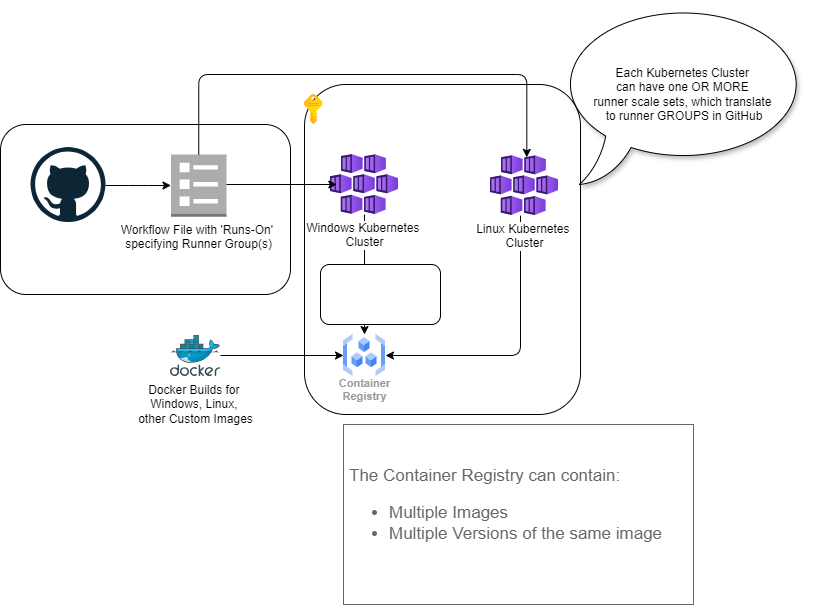

# GHA-ARC-CONFIGS

## Pre-Requisites
- An Azure Subscription
- An Azure Container Registry
- An Azure Kubernetes Cluster with sufficient Access to deploy HELM charts and make KUBECTL configurations
- Docker installed locally

## Deployment Steps
Note: The below deployment steps assume you have already build and configure the Actions Runner Controller and Listener for your Autoscaling Set

1. Build Dockerfile **example:** ```docker build -t gharcacr1.azurecr.io/actions-runner-windows:latest .```
2. Push Dockerfile to Azure Container Registry **example:** ```docker push gharcacr1.azurecr.io/actions-runner-windows:latest```
3. Ensure appropriate secret with permissions is added to namespace that the Kubectl configuration will use
4. Update the HELM installation
    ```helm upgrade arc-runner-set-win --namespace arc-runners-win -f runner-scale-set-win.yaml oci://ghcr.io/actions/actions-runner-controller-charts/gha-runner-scale-set```
5. Verify New Runners are creating successfully. **e.g.**
    ```kubectl get pods -n arc-systems-win```
6. Test Changes by verifying runners come online

# GHA-ARC-CONFIGS

## Pre-Requisites
- An Azure Subscription
- An Azure Container Registry
- An Azure Kubernetes Cluster with sufficient Access to deploy HELM charts and make KUBECTL configurations
- Docker installed locally

## Deployment Steps
Note: The below deployment steps assume you have already build and configure the Actions Runner Controller and Listener for your Autoscaling Set

1. Build Dockerfile **example:** ```docker build -t gharcacr1.azurecr.io/actions-runner-windows:latest .```
2. Push Dockerfile to Azure Container Registry **example:** ```docker push gharcacr1.azurecr.io/actions-runner-windows:latest```
3. Ensure appropriate secret with permissions is added to namespace that the Kubectl configuration will use
4. Update the HELM installation
    ```helm upgrade arc-runner-set-win --namespace arc-runners-win -f runner-scale-set-win.yaml oci://ghcr.io/actions/actions-runner-controller-charts/gha-runner-scale-set```
5. Verify New Runners are creating successfully. **e.g.**
    ```kubectl get pods -n arc-systems-win```
6. Test Changes by verifying runners come online




